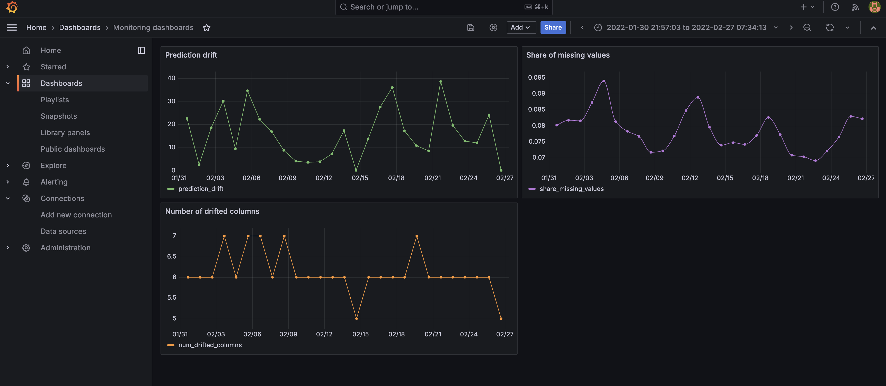

## Surveillance des dérives de données avec Evidently AI et Grafana

Bienvenue dans ce référentiel pour surveiller les dérives de données à l'aide d'Evidently AI et Grafana. Ce guide vous aidera à configurer un système robuste pour garantir que vos modèles d'apprentissage automatique restent précis et fiables au fil du temps.

### Vue d'ensemble

La dérive des données peut avoir un impact significatif sur les performances des modèles d'apprentissage automatique. Ce projet fournit une solution complète pour surveiller les dérives de données en exploitant Evidently AI pour générer des métriques et Grafana pour la visualisation. La configuration utilise Docker Compose pour faciliter le déploiement et la gestion des services.

### Fonctionnalités
* **Surveillance des dérives de données** : Suivez les changements dans la distribution des données et assurez-vous que vos modèles restent performants.
* **Visualisation** : Utilisez Grafana pour visualiser les métriques de dérive et obtenir des informations sur la qualité des données.
* **Configuration facile** : Déployez PostgreSQL, Adminer et Grafana avec Docker Compose.

### Installation 

Créer un environnement virtuel :

```
python -m venv venv
```

Activer l'environnement virtuel :
* Sous Windows :
```
myenv\Scripts\activate
```
* Sous macOS et Linux :

```
source venv/bin/activate
```

Installer les dépendances :

```
pip install -r requirements.txt
```

Installer un nouveau package si nécessaire :

```
pip install {nom_du_package}
pip freeze > requirements.txt
```

Désactiver l'environnement virtuel :
```
deactivate
```

N'oubliez pas d'activer l'environnement virtuel chaque fois que vous revenez dans le projet.

### Exécution 

```
docker-compose up --build
```

Grafana est accessible à l'adresse `http://localhost:3000`

La base de données est accessible à l'adresse `http://localhost:8080/`

Exécutez le script de génération de données :

```
python generate_data.py
```

Pour arrêter :

```
docker-compose down
```

Pour accéder à Evidently pour la surveillance :

```
evidently ui  
```


